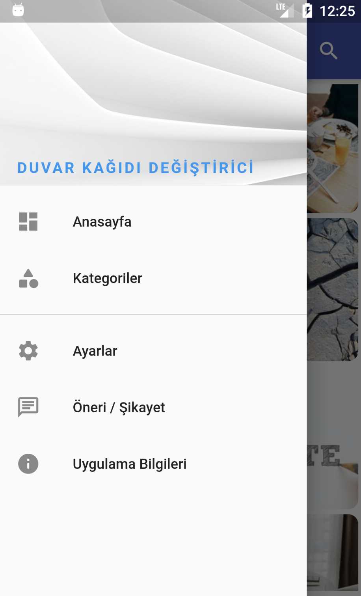
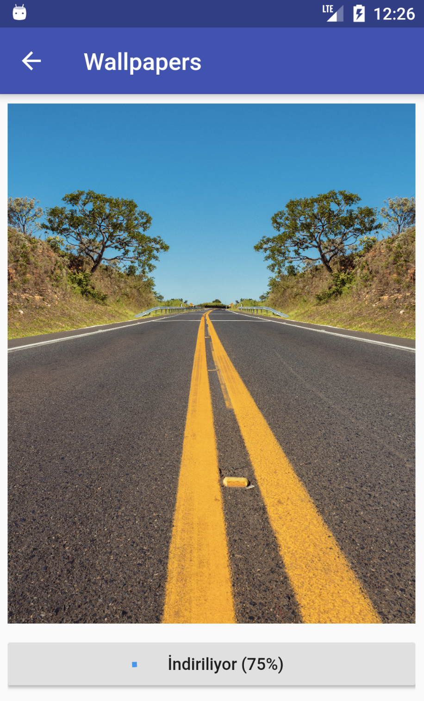

# Wallpaper App

Wallpaper app built with Flutter. This app has a backend.
Backend is [here](https://github.com/kodmanyagha/wallpaper-admin).

This app is requesting to our API and getting image information.

## Screenshot

